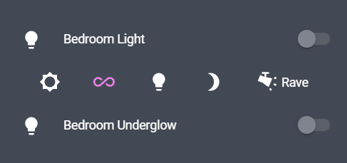
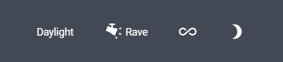
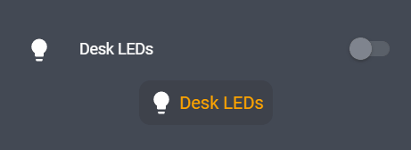
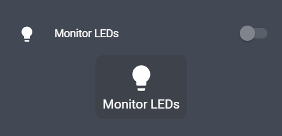
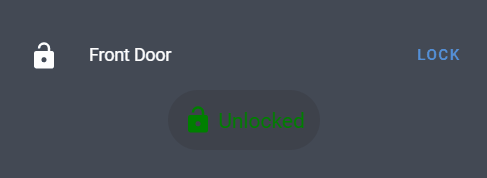
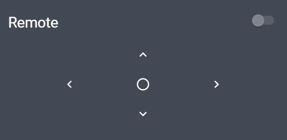

# Paper Buttons Row

[](https://github.com/custom-components/hacs)

This is a complete rewrite of the original [`button-entity-row`](https://github.com/custom-cards/button-entity-row) plugin, that is more consistent with Home Assistant's [button card](https://www.home-assistant.io/lovelace/button/), it uses **actions** including `tap_action`, `double_tap_action` and `hold_action` allowing for greater customisation of the buttons behaviour. It also retains the ability to style the button based on state, but adds the ability to style the icon, text, and ripple effect separately. There is a new option for **icon alignment** and the buttons have haptic feedback.



## Options

| Name              | Type                                                  | Requirement  | Description                                                                                                     |
| ----------------- | ----------------------------------------------------- | ------------ | --------------------------------------------------------------------------------------------------------------- |
| type              | `string`                                              | **Required** | `custom:paper-buttons-row`                                                                                      |
| buttons           | List [`string` or [`button object`](#button-options)] | **Required** | List of buttons to display. [See button options](#button-options)                                               |
| align_icons       | `string`                                              | **Optional** | Specify the default alignment for icons, must be one of [`top`, `left`, `right`, `bottom`], defaults to `left`. |
| base_style        | [`style object`](#style-options)                      | **Optional** | Specify a default `style` by each button, this can be overriden for each button                                 |
| base_state_styles | `map[state: style object]`                            | **Optional** | Specify a default `state_styles` by each button, this can be overriden for each button                          |

### Button Options

When only an `entity` is provided the button will attempt to toggle it by default.

| Name              | Type                             | Requirement  | Description                                                                                                              |
| ----------------- | -------------------------------- | ------------ | ------------------------------------------------------------------------------------------------------------------------ |
| entity            | `string`                         | **Optional** | The entity_id of the entity you want to show.                                                                            |
| name              | `string`                         | **Optional** | Name to use for entity. Use `false` to hide name.                                                                        |
| icon              | `string`                         | **Optional** | The icon to display. Use `false` to hide icon.                                                                           |
| align_icon        | `string`                         | **Optional** | Override the default alignment for icon, must be one of [`top`, `left`, `right`, `bottom`].                              |
|                   |                                  |              |                                                                                                                          |
| tap_action        | `map`                            | **Optional** | Tap action map [See action options](#action-options)                                                                     |
| hold_action       | `map`                            | **Optional** | Hold action map [See action options](#action-options)                                                                    |
| double_tap_action | `map`                            | **Optional** | Double Tap action map [See action options](#action-options)                                                              |
|                   |                                  |              |                                                                                                                          |
| style             | [`style object`](#style-options) | **Optional** | Map of CSS styles to apply to the button, icon, text or ripple. [See style options](#style-options)                      |
| state_styles      | `map[state: style object]`       | **Optional** | Map of states to a [`style object`](#style-options), [See example](#using-style-and-state_styles).                       |
| state_icons       | `map[state: icon]`               | **Optional** | Material icon for each state of the entity. Map state to icon, [See example](#using-state-icons-state-text-and-actions). |
| state_text        | `map[state: text]`               | **Optional** | Button text for each state of the entity, Map state to text, [See example](#using-state-icons-state-text-and-actions).   |

### Action Options

Each button supports the same actions as seen in Home Assistant's [button card](https://www.home-assistant.io/lovelace/button).

| Name              | Type           | Default  | Supported options                                                                                   | Description                                                                                               |
| ----------------- | -------------- | -------- | --------------------------------------------------------------------------------------------------- | --------------------------------------------------------------------------------------------------------- |
| `action`          | `string`       | `toggle` | `more-info`, `toggle`, `call-service`, `fire-event`, `none`, `navigate`, `url`                      | Action to perform                                                                                         |
| `entity`          | `string`       | none     | Any entity id                                                                                       | **Only valid for `action: more-info`** to override the entity on which you want to call `more-info`       |
| `navigation_path` | `string`       | none     | Eg: `/lovelace/0/`                                                                                  | Path to navigate to (e.g. `/lovelace/0/`) when action defined as navigate                                 |
| `url_path`        | `string`       | none     | Eg: `https://www.google.com`                                                                        | URL to open on click when action is `url`.                                                                |
|                   |                |          |                                                                                                     |                                                                                                           |
| `service`         | `string`       | none     | Any service                                                                                         | Service to call (e.g. `media_player.media_play_pause`) when `action` defined as `call-service`            |
| `service_data`    | `map`          | none     | Any service data                                                                                    | Service data to include (e.g. `entity_id: media_player.bedroom`) when `action` defined as `call-service`. |
|                   |                |          |                                                                                                     |                                                                                                           |
| `event_type`      | `string`       | none     | Any event                                                                                           | Event to call (e.g. `custom_event`) when `action` defined as `fire-event`                                 |
| `event_data`      | `map`          | none     | Any event data                                                                                      | Event data to include when `action` defined as `fire-event`.                                              |
|                   |                |          |                                                                                                     |                                                                                                           |
| `confirmation`    | `boolean\|map` | false    | [See confirmation object](https://www.home-assistant.io/lovelace/actions/#options-for-confirmation) | Present a confirmation dialog to confirm the action.                                                      |

### Style Options

| Name   | Type     | Requirement  | Description                                            |
| ------ | -------- | ------------ | ------------------------------------------------------ |
| button | `object` | **Optional** | CSS styles to apply to the button.                     |
| icon   | `object` | **Optional** | CSS styles to apply to specifically the icon.          |
| text   | `object` | **Optional** | CSS styles to apply to specifically the button text.   |
| ripple | `object` | **Optional** | CSS styles to apply to specifically the ripple effect. |

## Examples

### Minimal Setup.



```yaml
type: entities
entities:
  - type: "custom:paper-buttons-row"
    buttons:
      - scene.daylight # simplest way to create a button.

      - entity: scene.rave
        icon: "mdi:track-light" # override or add a mdi icon.

      - entity: script.light_colour_flow
        icon: "mdi:all-inclusive"
        name: false # makes the button icon only.

      - entity: scene.evening
        icon: "mdi:brightness-3"
        name: false
```

---

### Using style and state_styles.




```yaml
type: entities
entities:
  - type: "custom:paper-buttons-row"
    buttons:
      - entity: light.desk_leds
        icon: "mdi:lightbulb"
        style: # These are the default styles that can be overridden by state styles.
          button:
            border-radius: 10px
            font-size: 16px
        state_styles:
          "off": # define a state then provide a style object.
            button:
              background-color: var(--table-row-alternative-background-color)
            text:
              color: orange
          "on":
            button:
              background-color: var(--primary-color)
            icon:
              color: var(--paper-item-icon-active-color) # this will change the icon colour when the entities state is on.
            ripple:
              color: orange # colour the ripple effect.

      - entity: light.monitor_leds
        align_icon: top # change the icon alignment to be above the text.
        icon: "mdi:lightbulb"
        style:
          button:
            background-color: var(--table-row-alternative-background-color)
            border-radius: 10px
            font-size: 1.2rem
            padding: 8px
          icon:
            --mdc-icon-size: 40px # make the icon bigger.
        state_styles:
          "on":
            button:
              background-color: var(--primary-color)
            icon:
              color: var(--paper-item-icon-active-color)
            ripple:
              color: orange
```

---

### Using state icons, state text and actions.



```yaml
type: entities
entities:
  - type: "custom:paper-buttons-row"
    buttons:
      - entity: lock.front_door
        state_icons:
          "unlocked": "mdi:lock-open"
          "locked": "mdi:lock"
        state_text:
          "unlocked": "Unlocked"
          "locked": "Locked"

        state_styles:
          "unlocked":
            button:
              color: green
          "locked":
            button:
              color: red
        style:
          button:
            background-color: var(--table-row-alternative-background-color)
            border-radius: 40px
            padding: 10px
            font-size: 1.2rem

        tap_action:
          action: call-service
          service: lock.lock
          service_data:
            entity_id: lock.front_door

        hold_action:
          action: call-service
          service: lock.unlock
          service_data:
            entity_id: lock.front_door

          # it's also possible to add a confirmation dialog to the action.
          confirmation:
            exemptions:
              - user: 22a1119b08c54960822a0c6b896bed2
            text: Are you sure you want to unlock?
```

---

### Multiple rows of buttons.



```yaml
type: entities
entities:
  - type: "custom:paper-buttons-row"
    buttons:
      - icon: "mdi:chevron-up"
        tap_action:
          action: call-service
          service: esphome.family_room_node_transmit_panasonic
          service_data:
            command: 218145196

  # for multiple rows define multiple `paper-buttons-row`s.
  - type: "custom:paper-buttons-row"
    buttons:
      - icon: "mdi:chevron-left"
        tap_action:
          action: call-service
          service: esphome.family_room_node_transmit_panasonic
          service_data:
            command: 218161644
      - icon: "mdi:checkbox-blank-circle-outline"
      - icon: "mdi:chevron-right"
        tap_action:
          action: call-service
          service: esphome.family_room_node_transmit_panasonic
          service_data:
            command: 218108188

  - type: "custom:paper-buttons-row"
    buttons:
      - icon: "mdi:chevron-down"
        tap_action:
          action: call-service
          service: esphome.family_room_node_transmit_panasonic
          service_data:
            command: 218128748
```

```yaml
type: entities
entities:
  - type: "custom:paper-buttons-row"
    buttons:
      # multiple rows of buttons can also be defined in one paper-buttons-row
      # by using a list of lists of buttons.
      - - light.monitor_leds
        - light.desk_leds

      - - light.bedroom_light
        - entity: light.bedroom_underglow
          icon: "mdi:lightbulb"
```

## Installation

```yaml
resources:
  - url: /hacsfiles/lovelace-paper-buttons-row/paper-buttons-row.js
    type: module
```
