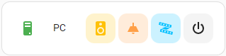
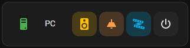
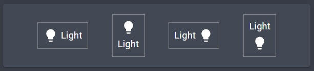
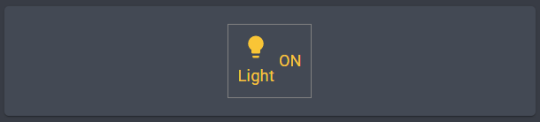
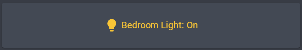
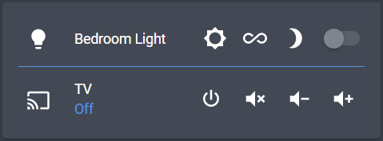

# Paper Buttons Row

[](https://github.com/hacs/integration)
[](https://github.com/jcwillox/lovelace-paper-buttons-row/blob/main/LICENSE)
[](https://github.com/jcwillox/lovelace-paper-buttons-row/releases)
[](https://github.com/jcwillox/lovelace-paper-buttons-row/releases)

This is a complete rewrite of the original [`button-entity-row`](https://github.com/custom-cards/button-entity-row) plugin, that is more consistent with Home Assistant's [button card](https://www.home-assistant.io/lovelace/button/), it uses **actions** including `tap_action`, `double_tap_action` and `hold_action` allowing for greater customisation of the buttons behaviour. It also retains the ability to style the button based on state, but adds the ability to style the icon, text, and ripple effect separately. There is a new option for **icon alignment** and the buttons have haptic feedback.


## Options

| Name         | Type                                                  | Requirement  | Description                                                                                                                                           |
| ------------ | ----------------------------------------------------- | ------------ | ----------------------------------------------------------------------------------------------------------------------------------------------------- |
| type         | `string`                                              | **Required** | `custom:paper-buttons-row`                                                                                                                            |
| preset       | `string`                                              | **Optional** | The preset configuration to use e.g. `mushroom`. [See presets](#presets)                                                                              |
| buttons      | List [`string` or [`button object`](#button-options)] | **Required** | List of buttons to display. [See button options](#button-options)                                                                                     |
| base_config  | [`button object`](#button-options)                    | **Optional** | Specify a base config that will be deep-merged with each buttons config. Buttons can override the base config                                         |
| styles       | `object`                                              | **Optional** | CSS styles to apply to the entire button group. e.g. to change the flex-box alignment.                                                                |
| extra_styles | `string`                                              | **Optional** | Inject CSS directly into the paper-buttons-row container, useful for animations. [See extra styles](#extra-styles)                                    |
|              |                                                       |              |                                                                                                                                                       |
| position     | `"center"` \| `"right"`                               | **Optional** | Position embedded buttons in the middle or end of the entity-row (default: `center`). [See embedding in entity rows](#embedding-in-other-entity-rows) |
| hide_badge   | `boolean`                                             | **Optional** | Hide state badge when embedding in an entity-row                                                                                                      |
| hide_state   | `boolean`                                             | **Optional** | Hide state text or toggle when embedding in an entity-row                                                                                             |

### Button Options

When only an `entity` is provided the button will attempt to toggle it by default.

| Name              | Type                                           | Requirement  | Description                                                                                                                                      |
| ----------------- | ---------------------------------------------- | ------------ | ------------------------------------------------------------------------------------------------------------------------------------------------ |
| entity            | `string`                                       | **Optional** | The entity_id of the entity you want to show.                                                                                                    |
| name              | `string` \| [`template`](#templating)          | **Optional** | Name to use for entity. Use `false` to hide name.                                                                                                |
| state             | `string` \| [`template`](#templating)          | **Optional** | State to display for entity. Use `true` to show the entity state.                                                                                |
| icon              | `string` \| [`template`](#templating)          | **Optional** | The icon to display. Use `false` to hide icon.                                                                                                   |
| image             | `string` \| [`template`](#templating)          | **Optional** | Display an image instead of an icon. e.g. `/local/custom.png`.                                                                                   |
| preset            | `string`                                       | **Optional** | The preset configuration to use e.g. `mushroom`. [See presets](#presets)                                                                         |
| active            | `string` \| `list[string]`                     | **Optional** | Configure the states which the button considers itself to be active, defaults to [`on`, `open`, `unlocked`]. [See CSS variables](#css-variables) |
| ripple            | `"fill"` \| `"none"` \| `"circle"`             | **Optional** | Override the default shape of the ripple.                                                                                                        |
| layout            | `string` \| `object`                           | **Optional** | Change the layout of the icon, name and state fields. [See layout options](#layout)                                                              |
| tooltip           | `string`                                       | **Optional** | Override the default tooltip. Use `false` to hide tooltip.                                                                                       |
|                   |                                                |              |                                                                                                                                                  |
| tap_action        | `map`                                          | **Optional** | Tap action map [See action options](#action-options)                                                                                             |
| hold_action       | `map`                                          | **Optional** | Hold action map [See action options](#action-options)                                                                                            |
| double_tap_action | `map`                                          | **Optional** | Double Tap action map [See action options](#action-options)                                                                                      |
|                   |                                                |              |                                                                                                                                                  |
| styles            | [`style object`](#style-options) (templatable) | **Optional** | Map of CSS styles to apply to the button, icon, text or ripple. [See style options](#style-options)                                              |
| state_styles      | `map[state: style object]`                     | **Optional** | Map of states to a [`style object`](#style-options), [See example](#using-style-and-state_styles).                                               |
| state_icons       | `map[state: icon]`                             | **Optional** | Material icon for each state of the entity. Map state to icon, [See example](#using-state-icons-state-text-and-actions).                         |
| state_text        | `map[state: text]`                             | **Optional** | Button text for each state of the entity, Map state to text, [See example](#using-state-icons-state-text-and-actions).                           |

### Action Options

Each button supports the same actions as seen in Home Assistant's [button card](https://www.home-assistant.io/lovelace/button).

| Name              | Type           | Default  | Supported options                                                                                   | Description                                                                                                         |
| ----------------- | -------------- | -------- | --------------------------------------------------------------------------------------------------- | ------------------------------------------------------------------------------------------------------------------- |
| `action`          | `string`       | `toggle` | `more-info`, `toggle`, `call-service`, `fire-event`, `none`, `navigate`, `url`                      | Action to perform                                                                                                   |
| `entity`          | `string`       | none     | Any entity id                                                                                       | **Only valid for `action: more-info`** to override the entity on which you want to call `more-info`                 |
| `navigation_path` | `string`       | none     | Eg: `/lovelace/0/`                                                                                  | Path to navigate to (e.g. `/lovelace/0/`) when action defined as navigate                                           |
| `url_path`        | `string`       | none     | Eg: `https://www.google.com`                                                                        | URL to open on click when action is `url`.                                                                          |
|                   |                |          |                                                                                                     |                                                                                                                     |
| `service`         | `string`       | none     | Any service                                                                                         | Service to call (e.g. `remote.send_command`) when `action` defined as `call-service`                                |
| `service_data`    | `map`          | none     | Any service data                                                                                    | Service data to include (e.g. `command: play_pause`) when `action` defined as `call-service`.                       |
| `target`          | `map`          | none     | Any service target                                                                                  | Service target to include (e.g. `entity_id: remote.bedroom`) when `action` defined as `call-service`.               |
|                   |                |          |                                                                                                     |                                                                                                                     |
| `event_type`      | `string`       | none     | Any event                                                                                           | Event to call (e.g. `custom_event`) when `action` defined as `fire-event`                                           |
| `event_data`      | `map`          | none     | Any event data                                                                                      | Event data to include when `action` defined as `fire-event`.                                                        |
|                   |                |          |                                                                                                     |                                                                                                                     |
| `repeat`          | `number`       | none     | Eg: `500`                                                                                           | **Only valid for `hold_action`** optionally set the action to repeat every N milliseconds while the button is held. |
|                   |                |          |                                                                                                     |                                                                                                                     |
| `confirmation`    | `boolean\|map` | false    | [See confirmation object](https://www.home-assistant.io/lovelace/actions/#options-for-confirmation) | Present a confirmation dialog to confirm the action.                                                                |

### Presets

A preset is just a predefined [button config](#button-options) object that will be deep-merged with the config, just like the `base_config` option.

**Built-in Presets**

Presets are now supported by default only the `mushroom` preset is included.





```yaml
type: entities
entities:
  - type: custom:paper-buttons-row
    # apply to all buttons
    preset: mushroom
    base_config:
      # the same as above applies to all buttons
      preset: mushroom
    buttons:
      - entity: light.bedroom_light
        # or override on a button level
        preset: mushroom

      - entity: lock.front_door
        # set what state is considered active
        active: unlocked
        styles:
          # override the inactive color
          --pbs-button-rgb-color: red
          # override the active color
          --pbs-button-rgb-active-color: green

      - icon: mdi:power
```

**User-defined Presets**

Presets can be defined in the top level of your dashboard, using the "Raw configuration editor" mode.

```yaml
paper_buttons_row:
  presets:
    my_custom_preset:
      ripple: fill
      styles:
        button:
          color: red

views: ...
```

### Style Options

| Name   | Type     | Requirement  | Description                                            |
| ------ | -------- | ------------ | ------------------------------------------------------ |
| button | `object` | **Optional** | CSS styles to apply to the button.                     |
| icon   | `object` | **Optional** | CSS styles to apply to specifically the icon.          |
| name   | `object` | **Optional** | CSS styles to apply to specifically the name field.    |
| state  | `object` | **Optional** | CSS styles to apply to specifically the state field.   |
| ripple | `object` | **Optional** | CSS styles to apply to specifically the ripple effect. |

Each key can be templated e.g.

```yaml
styles:
  button:
    color: >-
      
        red
      
        cyan
      
```

### CSS Variables

**Base State**

- `--pbs-button-color` – used to override the color of the button.
- `--pbs-button-rgb-color` – same as above but expects a list of rgb values, e.g. `123, 123, 0`.
- `--pbs-button-rgb-state-color` – this is set automatically to reference an `--rgb-state-*-color` variable.
- `--pbs-button-rgb-default-color` - this is used to set the default color of the paper-buttons, it is not set by default.
- `--rgb-state-default-color` – this is the default color provided by Home Assistant.

**Base State (Background)**

- `--pbs-button-bg-color` – used to override the background of the button default is not set.
- `--pbs-button-rgb-bg-color` – same as above but expects a list of rgb values, e.g. `123, 123, 0`.
- `--pbs-button-rgb-bg-opacity` – defaults to 1.

**Active State**

- `--paper-item-icon-active-color` – (deprecated) unset in 2022.12 was originally set to `#fdd835`.
- `--pbs-button-active-color`
- `--pbs-button-rgb-active-color`
- `--pbs-button-rgb-state-color`
- `--pbs-button-rgb-default-color`
- `--rgb-state-default-color`

**Active State (Background)**

- `--pbs-button-bg-active-color`
- `--pbs-button-rgb-bg-active-color`
- `--pbs-button-rgb-bg-active-opacity`
- `--pbs-button-rgb-bg-color`
- `--pbs-button-rgb-bg-opacity`

**Unavailable State**

- `--pbs-button-unavailable-color`
- `--pbs-button-rgb-unavailable-color`
- `--rgb-disabled-color`

### Extra Styles

The `extra_styles` option allow you to embed extra CSS into paper-buttons-row this allows you to specify custom animations and style the hover and active states among other things.

**Animations & Hover/Active Effects**


There are two built-in animations `blink` and `rotating`.

```yaml
- type: custom:paper-buttons-row
  extra_styles: |
    /* define custom animation */
    @keyframes bgswap1 {
      0% {
        background-image: url("/local/christmas-lights-ro.png");
      }
      25% {
        background-image: url("/local/christmas-lights-ro.png");
      }
      50% {
        background-image: url("/local/christmas-lights-gb.png");
      }
      75% {
        background-image: url("/local/christmas-lights-gb.png");
      }
      100% {
        background-image: url("/local/christmas-lights-ro.png");
      }
    }
    /* set hover and active effects for buttons */
    paper-button:hover {
      background-color: red;
    }
    paper-button:active {
      background-color: yellow;
    }
    /* styles for the third button only */
    paper-button:nth-child(3):hover {
      background-color: green;
    }
    paper-button:nth-child(3):active {
      background-color: purple;
    }
  buttons:
    - icon: mdi:power
      styles:
        button:
          animation: blink 2s ease infinite
    - styles:
        button:
          width: 64px
          height: 64px
          background-size: cover
          # use custom animation defined earlier
          animation: bgswap1 2s ease infinite
    - icon: mdi:power
      styles:
        button:
          - animation: rotating 2s ease infinite
```

#### Data Attributes

If you use the [`extra_styles`](#extra-styles) option you can use data attributes to style the button based on the domain or state of the configured entity.

- `data-domain` – The domain of the entity
- `data-state` – The current templated state, which defaults to the entity state but could refer to an attribute if you configure the `state` option
- `data-entity-state` – The state of the current entity.

```css
paper-button[data-state="on"] {
  color: red;
}
```

### Global styles & base config

You can specify `styles` that apply to the actual flex-box used to contain each row of buttons. You can also specify a default `base_config` that is deep-merged with the config for each button, this helps reduce repetition in your configs.

```yaml
type: custom:paper-buttons-row
# styles applied to the row container
styles:
  # override off/on colors
  --pbs-button-bg-color: red
  --pbs-button-bg-active-color: green
  # align all buttons to the left
  justify-content: flex-start
buttons:
  - entity: light.bedroom_light
```

```yaml
type: custom:paper-buttons-row
base_config:
  # will be applied to all configured buttons
  state_styles:
    "on":
      # override color for the entire button
      button:
        color: yellow
      # or override for the name only
      name:
        color: var(--primary-text-color)
    "off":
      button:
        color: red
buttons:
  - entity: light.bedroom_light
  - entity: light.kitchen_light
```

### Layout

The pipe or bar `|` symbol is used to put elements next to each other, and an underscore `_` is used to place items below each other.
You can also define layouts using a list (row) and nested lists (columns).

These are some examples of simple layouts:



```yaml
type: entities
entities:
  - type: custom:paper-buttons-row
    buttons:
      - entity: light.bedroom_light
        layout: icon|name
        # layout: [icon, name]

      - entity: light.bedroom_light
        layout: icon_name
        # layout: [[icon, name]]

      - entity: light.bedroom_light
        layout: name|icon
        # layout: [name, icon]

      - entity: light.bedroom_light
        layout: name_icon
        # layout: [[name, icon]]
```

Advanced example



```yaml
type: entities
entities:
  - type: custom:paper-buttons-row
    buttons:
      - entity: light.bedroom_light
        layout: icon_name|state
        # layout: [[icon, name], [state]]
```

### Templating

#### Template Object

| Name        | Type     | Description                                                                       |
| ----------- | -------- | --------------------------------------------------------------------------------- |
| `entity`    | `string` | Optional: entity to extract data from, defaults to the rows configured entity.    |
| `attribute` | `object` | Optional: extract an attribute from the entity, otherwise the state will be used. |
| `prefix`    | `string` | Optional: string to append **before** the attribute/state.                        |
| `postfix`   | `string` | Optional: string to append **after** the attribute/state.                         |
| `case`      | `string` | Optional: change case of result must be one of `upper`, `lower`, `first`          |

**Examples**



```yaml
type: entities
entities:
  - type: custom:paper-buttons-row
    buttons:
      - entity: light.bedroom_light
        layout: icon|name|state
        name:
          attribute: friendly_name
          postfix: ": "
        state:
          case: first
```

The `state_text` and `state_styles` options will use the lowercase result of the template for the state field.

```yaml
type: entities
entities:
  - type: "custom:paper-buttons-row"
    buttons:
      - entity: fan.bedroom
        layout: icon|state
        state:
          attribute: speed
        state_styles:
          high:
            color: red
          medium:
            color: yellow
          low:
            color: green
        state_text:
          high: III
          medium: II
          low: I
        # ...
```

#### Jinja Templates

_Note: that Jinja2 templates are slightly slower to load initially due to latency, as they are rendered in the backend, whereas the other are rendered in the frontend._

Jinja templates have access to a few special variables. Those are:

- `config` - an object containing the entity row configuration.
- `entity` - the entity_id from the current entity row configuration. This **must** be used instead of `config.entity` for the template to automatically update.
- `user` - the username of the currently logged in user.
- `browser` - the deviceID of the current browser (see [browser_mod](https://github.com/thomasloven/hass-browser_mod)).
- `hash` - the hash part of the current URL.

**Example**

```yaml
type: entities
entities:
  - type: custom:paper-buttons-row
    buttons:
      - entity: light.bedroom_light
        layout: icon|name|state
        name: "{{ state_attr(config.entity, 'friendly_name') }}: "
        state: "{{ states(config.entity) | title }}"
```

## Embedding in other entity rows



Paper Buttons Row can be embedded within most entity rows. As shown in the image above it inserts a `paper-buttons-row` row inline, this can be either before or after the final element.

```yaml
type: entities
entities:
  - entity: light.bedroom_light
    # add the following to a normal entity row to embed paper buttons.
    extend_paper_buttons_row:
      position: # can be either `center` or `right`, defaults to `center`.
      # ... normal paper-buttons-row config goes here.
```

When extending entity rows there are options to control the position of the inserted buttons, as well as to hide the badge or state elements.


```yaml
type: entities
entities:
  - entity: input_boolean.test
  - entity: input_boolean.test
    name: Hide State
    extend_paper_buttons_row:
      hide_state: true
      buttons:
        - icon: mdi:power
  - entity: input_select.test
  - entity: input_select.test
    name: Hide Badge
    extend_paper_buttons_row:
      hide_badge: true
      position: right
      buttons:
        - icon: mdi:close
```

<details>
<summary>Full example for the image above</summary>

```yaml
type: entities
show_header_toggle: false
entities:
  - entity: light.bedroom_light
    extend_paper_buttons_row:
      # position defaults to center.
      buttons:
        - entity: scene.daylight
          icon: "mdi:brightness-5"
          name: false
        - entity: script.light_colour_flow
          icon: "mdi:all-inclusive"
          name: false
        - entity: scene.evening
          icon: "mdi:brightness-3"
          name: false
          styles:
            button:
              margin-right: 8px

  - type: divider

  - entity: media_player.family_room_tv
    name: TV
    extend_paper_buttons_row:
      # position after power button.
      position: right
      # use base config to set the default margin for all buttons.
      base_config:
        styles:
          button:
            margin-left: 2px
            margin-right: 2px
      buttons:
        - icon: "mdi:volume-mute"
          # override left margin for first button.
          styles:
            button:
              margin-left: 0px
        - icon: "mdi:volume-minus"
        - icon: "mdi:volume-plus"
```

</details>

## Examples

### Minimal Setup.


```yaml
type: entities
entities:
  - type: "custom:paper-buttons-row"
    buttons:
      - scene.daylight # simplest way to create a button.

      - entity: scene.rave
        icon: "mdi:track-light" # override or add a mdi icon.

      - entity: script.light_colour_flow
        icon: "mdi:all-inclusive"
        name: false # makes the button icon only.

      - entity: scene.evening
        icon: "mdi:brightness-3"
        name: false
```

---

### Using style and state_styles.


```yaml
type: entities
entities:
  - type: "custom:paper-buttons-row"
    buttons:
      - entity: light.desk_leds
        icon: "mdi:lightbulb"
        styles: # These are the default styles that can be overridden by state styles.
          button:
            border-radius: 10px
            font-size: 16px
        state_styles:
          "off": # define a state then provide a style object.
            button:
              background-color: var(--table-row-alternative-background-color)
            name:
              color: orange
          "on":
            button:
              background-color: var(--primary-color)
            icon:
              color: "#fdd835" # this will change the icon colour when the entities state is on.
            ripple:
              color: orange # colour the ripple effect.

      - entity: light.monitor_leds
        icon: "mdi:lightbulb"
        layout: icon_name
        # layout: [[icon, name]]
        styles:
          button:
            background-color: var(--table-row-alternative-background-color)
            border-radius: 10px
            font-size: 1.2rem
            padding: 8px
          icon:
            --mdc-icon-size: 40px # make the icon bigger.
        state_styles:
          "on":
            button:
              background-color: var(--primary-color)
            icon:
              color: "#fdd835"
            ripple:
              color: orange
```

---

### Using state icons, state text and actions.


```yaml
type: entities
entities:
  - type: "custom:paper-buttons-row"
    buttons:
      - entity: lock.front_door
        layout: icon|state # show the state field
        state_icons:
          "unlocked": "mdi:lock-open"
          "locked": "mdi:lock"
        state_text:
          "unlocked": "Unlocked"
          "locked": "Locked"

        state_styles:
          "unlocked":
            button:
              color: green
          "locked":
            button:
              color: red
        styles:
          button:
            background-color: var(--table-row-alternative-background-color)
            border-radius: 40px
            padding: 10px
            font-size: 1.2rem

        tap_action:
          action: call-service
          service: lock.lock
          service_data:
            entity_id: lock.front_door

        hold_action:
          action: call-service
          service: lock.unlock
          service_data:
            entity_id: lock.front_door

          # it's also possible to add a confirmation dialog to the action.
          confirmation:
            exemptions:
              - user: 22a1119b08c54960822a0c6b896bed2
            text: Are you sure you want to unlock?
```

---

### Multiple rows of buttons.


```yaml
type: entities
entities:
  - type: "custom:paper-buttons-row"
    buttons:
      - icon: "mdi:chevron-up"
        tap_action:
          action: call-service
          service: esphome.family_room_node_transmit_panasonic
          service_data:
            command: 218145196

  # for multiple rows define multiple `paper-buttons-row`s.
  - type: "custom:paper-buttons-row"
    buttons:
      - icon: "mdi:chevron-left"
        tap_action:
          action: call-service
          service: esphome.family_room_node_transmit_panasonic
          service_data:
            command: 218161644
      - icon: "mdi:checkbox-blank-circle-outline"
      - icon: "mdi:chevron-right"
        tap_action:
          action: call-service
          service: esphome.family_room_node_transmit_panasonic
          service_data:
            command: 218108188

  - type: "custom:paper-buttons-row"
    buttons:
      - icon: "mdi:chevron-down"
        tap_action:
          action: call-service
          service: esphome.family_room_node_transmit_panasonic
          service_data:
            command: 218128748
```

```yaml
type: entities
entities:
  - type: "custom:paper-buttons-row"
    buttons:
      # multiple rows of buttons can also be defined in one paper-buttons-row
      # by using a list of lists of buttons.
      - - light.monitor_leds
        - light.desk_leds

      - - light.bedroom_light
        - entity: light.bedroom_underglow
          icon: "mdi:lightbulb"
```

## Installation

```yaml
resources:
  - url: /hacsfiles/lovelace-paper-buttons-row/paper-buttons-row.js
    type: module
```
